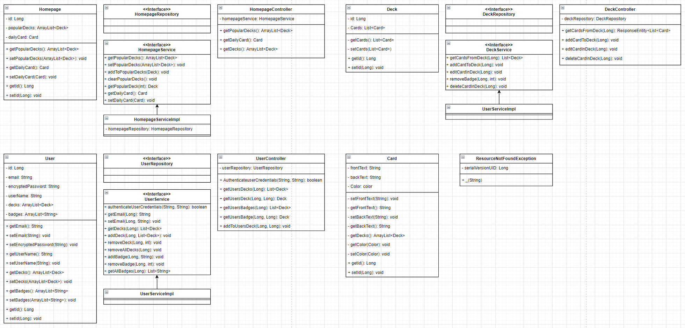

# Notecards-Spring
The back-end API for my [Notecards web application](https://github.com/michael-mcmasters/Notecards). Deployed using AWS Amplify and Elastic Beanstalk using AWS RDS for the MYSQL database.
The project is still a work in progress but you can see the UML I'm following below.

[Live API](http://springbootnotecardsrds-env.eba-bqdsyfni.us-east-1.elasticbeanstalk.com/cards)  
[Live Front-End Website](https://master.d2u3nakn42rssp.amplifyapp.com/)  
[Front-End Repository](https://github.com/michael-mcmasters/Notecards)  

# UML

